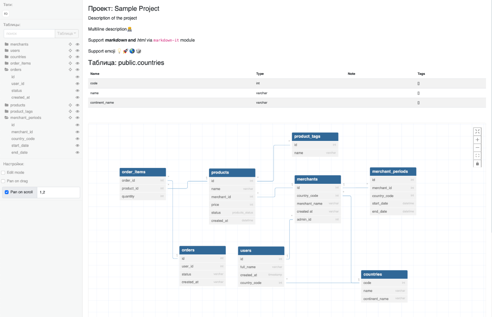

# DBML Visualizer

Standalone визуалиатор DBML.

## Roadmap
- [x] Отображение данных по 1 таблице
- [x] Отрисовка полей таблицы и данных о таблице
- [x] Фильтр по таблицам
- [x] Редактор DBML на странице
- [ ] Возможность добавлять таблицы
- [x] Возможность строить связи
- [x] Тегирование таблицы, полей, связей
- [x] Поиск и фильр по таблицам, полям, тегам
- [ ] Визуализация группы таблиц (parent)
- [x] Цветовая маркировка таблиц
- [ ] Цветовая маркировка связей
- [ ] Цветовая маркировка полей
- [ ] GUI возможность выбора цвета таблицы
- [x] Отрисовка ERD
- [x] Отрисовка связей на ERD
- [x] Скрытие таблиц на ERD
- [x] Скрытие полей на ERD
- [x] ERD для отрисовки 1 таблицы и графа связей на 1 уровень
- [ ] Улучшить типы в @dbml/core
- [ ] Добавить поддержку namespace
- [ ] Resize left-panel
- [x] Custom ConnectionLine через SVG, чтобы точка была всем полем + расчет от центра либо от края кастомный path
- [x] перетягивать несколько таблиц (cmd + click выделяем несколько, потом тянем)
- [x] single html mode
- [ ] Составной FK (делать виртуальный field) для связи чтобы поле-поле связь была
- [ ] свой парсер dbml в свою структуру
- [ ] своя декларация схемы dbml через json-schema + адаптер текущей схемы в свою

